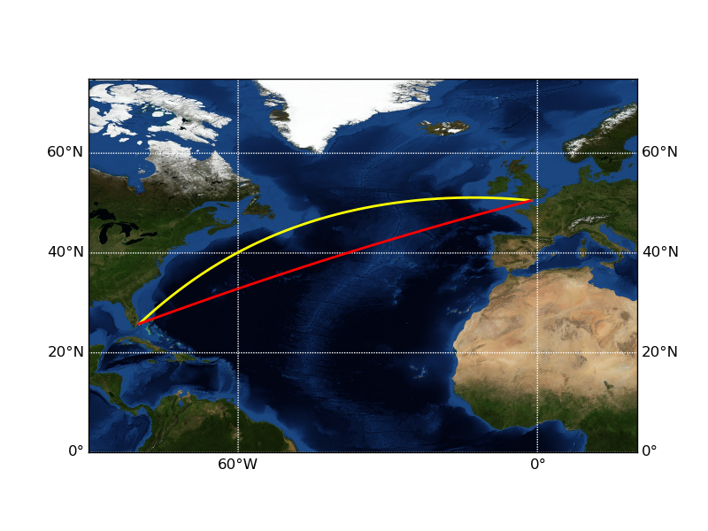
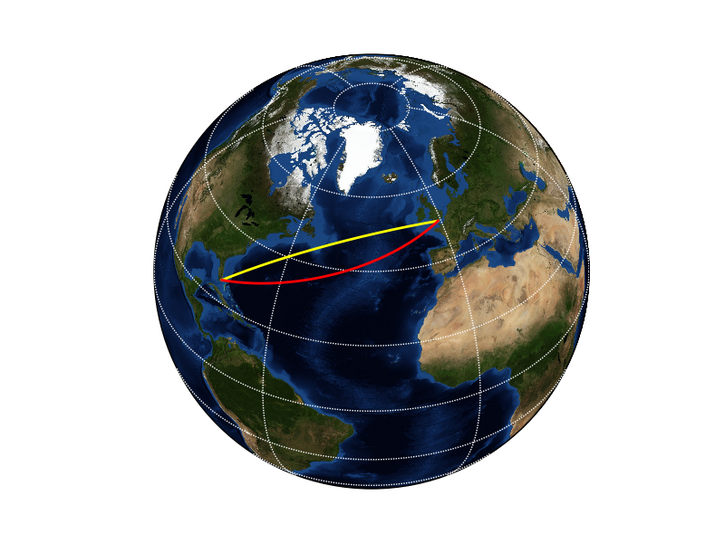

===================================================
Measuring geodetic distance calculation performance
===================================================

.. author:: Matti Airas
.. categories:: python
.. tags:: geodesy, optimization
.. comments::

Introduction
============

Earth is not flat, although, on many occasions, I wished it was.
Geometric calculations such as finding the distance between two points
or the closest distance between a line and a point are simple on flat surfaces,
but things become much more complex on a curved surface. Instead of geometric,
these operations are called geodetic calculations [#]_.

.. [#] http://en.wikipedia.org/wiki/Geodesy

The need for accurate geodetic computations
===========================================

On a traditional Mercator projection [#]_ map, such as the one shown in `Figure 1`_,
transatlantic navigation seems simple: just measure the angle between
your current location and the target, take a compass heading and steam on.
The red line on `Figure 1`_ shows the rhumb line [#]_ between Southampton and Miami.
Indeed, due to its simplicity, that still is a commonly used navigation method.
At this day, though, it's not really smart. If you draw the same route on a
different projection, such as the orthographic projection [#]_ in `Figure 2`_, it
becomes apparent that the red line is not the shortest one by any measure.

.. [#] http://en.wikipedia.org/wiki/Mercator_projection
.. [#] http://en.wikipedia.org/wiki/Rhumb_line
.. [#] http://en.wikipedia.org/wiki/Orthographic_projection_in_cartography

.. _`Figure 1`: Voyage from Southampton to New York, in Mercator projection.

.. _`Figure 2`: Voyage from Southampton to New York, in orthogonal projection.

The shortest route between two points on a spherical surface is along the
great circle [#]_, shown on `Figure 1`_ and `Figure 2`_ by the yellow lines. As indicated by the
curved line on the Mercator projection, the compass
heading varies along the great circle route, but nevertheless, that is the
optimal route to take. The rhumb line distance in our example is 3932
nautical miles (nmi), while the great circle distance is 3804 nmi,
a difference of 3.4%. On a suitable leg, the distance difference might be
considerably higher.

.. [#] http://en.wikipedia.org/wiki/Great_circle

Great circle calculations on a spherical surface are actually not that
complicated. Analytical (closed-form) solutions exist for most problems [#]_,
and although the formula are more more complex than their planar
geometry counterparts, the added complexity is insignificant for modern computers.

.. [#movabletype] See e.g. http://www.movable-type.co.uk/scripts/latlong.html

Unfortunately, our problems don't end here. Not only is the Earth round, but
it isn't round enough. Due to Earth's rotation, it is slightly
flattened at the poles: the diameter at the poles is approximately 42 km
shorter than the diameter at the equator [#]_. Hence, the Earth's shape is commonly
approximated as an ellipsoid. The measured flattening is quite small, 1:298.25,
but still is sufficient to cause errors of up to 0.55% (typically
less than 0.3%) if spherical assumption is used. Since the fuel savings
provided by `Eniram`_'s products are in the order of 2--6%, we definitely don't
have a sufficient margin to allow that kind of errors in our calculations.

As a practical example, on the Southampton--Miami voyage, the distance measured
on a WGS84 geoid is 6.6 nmi larger than on a spherical surface, an error of
0.17%. This error corresponds to 20--30 minutes of increased travel time,
or close to 1500-2000 USD of fuel costs on a big ship -- certainly nothing to
sneer at.

.. [#] http://en.wikipedia.org/wiki/Figure_of_the_Earth
.. _Eniram: http://www.eniram.fi

On ellipsoid surfaces, the great circle calculations get really complex.
No closed-form formula exist for most of the problems, and
numerical solutions must be used. Of course, excellent libraries performing
all the required calculations for different ellipsoids exist, e.g. `proj.4`_
and its Python bindings, pyproj_. However, the
numerical formula are much slower than the analytical ones. Many common
operations require a massive amount of geodetic calculations. For example, to
simply find out the distance remaining, we need to project the ship's actual location
on the pre-defined course, which can easily have ten or twenty waypoints.
Projection of a point on a line on an ellipsoid surface doesn't have a
closed-form solution and must be numerically approximated. Even with highly
optimized libraries such as proj.4, this is a slow operation.

.. _`proj.4`: http://trac.osgeo.org/proj/
.. _`pyproj`: https://code.google.com/p/pyproj/

Algorithm execution times
=========================

To illustrate the speed difference of different algorithms, I ran a piece
of code projecting 1000 points on a line with three different algorithms:
analytic (spherical projection), numeric (with pyproj) and hybrid. The
analytic algorithm uses closed-form formula presented in [#movabletype]_. The numeric and
hybrid algorithms find a numeric solution by optimizing the geometry shown in
`Figure 3`_. Distance ``y`` from ``P`` to ``P'`` is calculated for different values of ``d``.
When ``y`` is minimized, we have a solution for ``P'``. The difference between the
latter two algorithms is that the numeric one uses the GPS standard WGS84 [#]_ projection everywhere,
while the hybrid algorithm calculates the ``d`` and ``y`` distances using spherical
projection.

.. [#] http://en.wikipedia.org/wiki/World_Geodetic_System

.. _`Figure 3`: Numerical approximation of point projection.

`Figure 4`_ shows the test results. Even though the projection was run in a scalar
fashion (looping through the points) and therefore there was a significant
execution overhead, the analytic solution is almost an order of magnitude
faster than the numeric ones. There is a small but rather insignificant
gain acquired in the hybrid version.

.. _`Figure 4`: Test run results.

Discussion
==========

The test in the previous section was for one segment only. A typical voyage
contains multiple waypoints, and finding our location on the voyage requires
at least one projection calculation for each segment. Therefore, the algorithm
selection becomes crucial for our optimization performance. In practice,
we need to perform the projection calculations with the spherical formula,
and then re-calculate the distance d using the ellipsoid algorithms provided
by ``pyproj``. This provides us a reasonable accuracy and good computational
performance. This is one of the examples in which careful algorithm selection
is crucial. Without thinking, we could either have a really fast implementation and
insufficient accuracy, or a really accurate implementation running with a
glacial speed. By designing our implementation carefully, we are able to get
the best of the both worlds.

The calculations above leave much room for improvement regarding performance.
Direct Numpy implementation of the analytic spherical formula, even when
vectorized, requires multiple temporary arrays to store the intermediate results.
The ellipsoid versions do not run vectorized at all, but need to be looped
instead. In the next blog post, we will pluck some low-hanging performance fruit
by re-implementing our geodesy calculations in Cython.